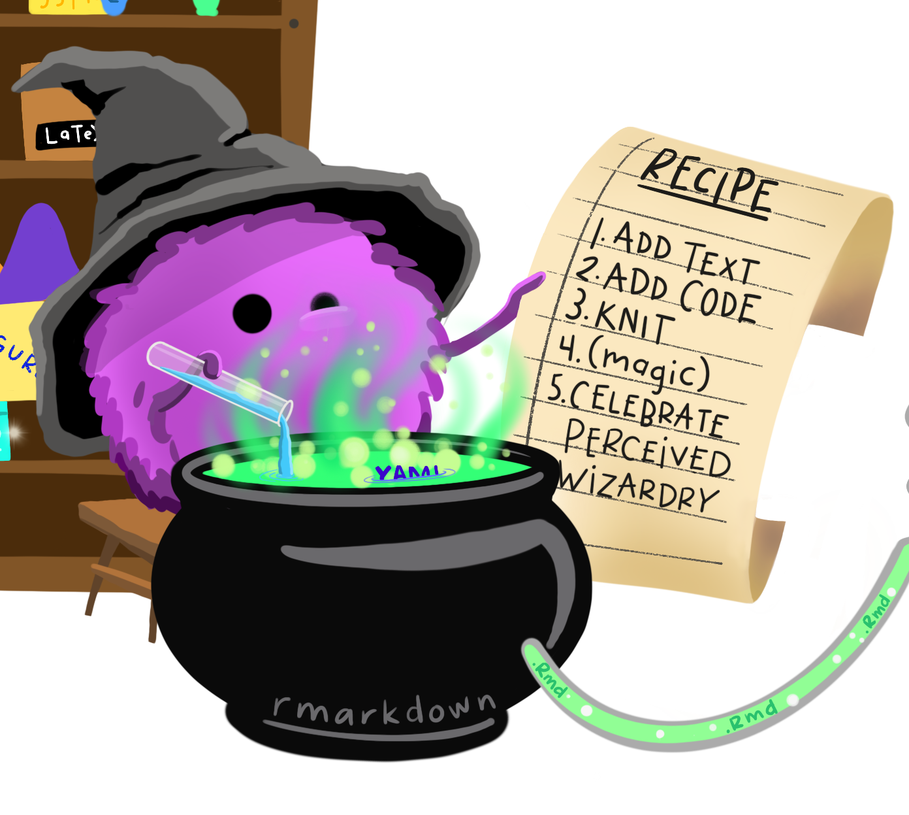
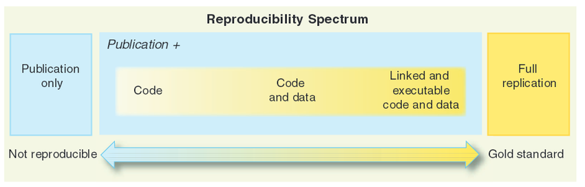
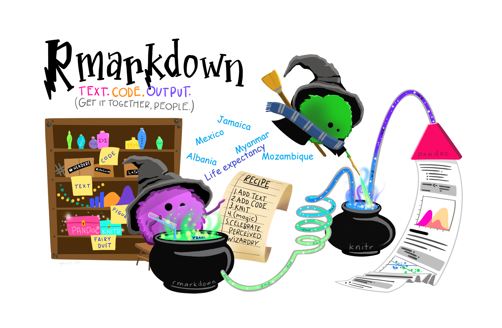
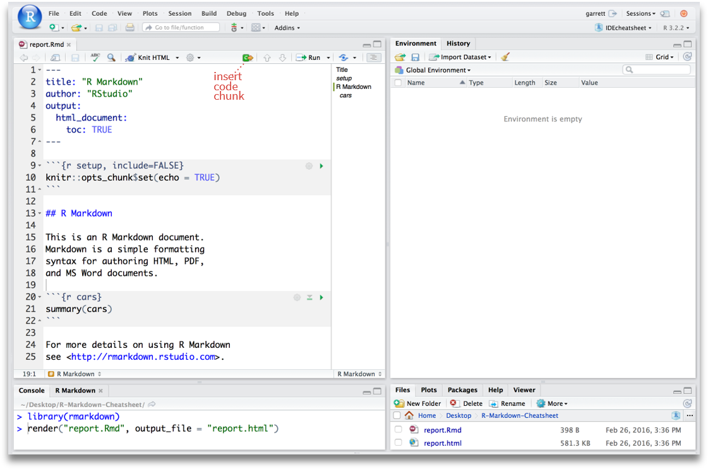
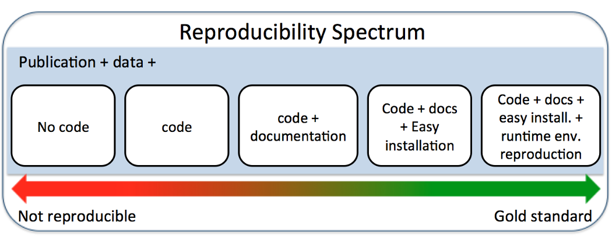

```{r libraries, results='hide', message=FALSE, echo = FALSE, warning=FALSE}

#install.packages("tidyverse")
#install.packages("gapminder")
#devtools::install_github("gadenbuie/countdown")


library(tidyverse)
library(gapminder)
library(countdown)
library(xaringanExtra)
library(kableExtra)

xaringanExtra::use_xaringan_extra(include = c("panelset", "tile_view", "share_again", "use_broadcast"))

xaringanExtra::style_share_again(share_buttons = c("twitter", "linkedin", "pocket"))

knitr::opts_chunk$set(out.height = "70%", out.width = "70%")

```


class: title-slide, center, bottom


# `r rmarkdown::metadata$title`


```{r, echo=FALSE, out.width=460, fig.cap="Rmarkdown: text, code, output",  fig.align='center'}

knitr::include_graphics("images/rmarkdown_wizards.png")

```

### `r rmarkdown::metadata$author`

#### `r rmarkdown::metadata$institute`

###### Artwork by @allisonhorst


```{r Prepping Country example, echo = FALSE}

# Country of Interest
gapminder_country <- gapminder %>%
  filter(country == params$country,
         year > 1980 & year <= 2010)

# Wider Continent
gapminder_continent <- gapminder %>%
  filter(continent == "Americas",
         year > 1980 & year <= 2010)

# Whole world
gapminder_sub <- gapminder %>%
  filter(year > 1980 & year <= 2010)
```


```{r average_lifeExp, echo = FALSE, warnings = FALSE}

average_lifeExp <- gapminder_country %>%
  summarise(average_lifeExp = round(mean(lifeExp), 2))

lifeExp_country <- gapminder_continent %>%
  group_by(country) %>%
  summarise(mean_lifeExp = mean(lifeExp))


```


```{r setup, include=FALSE}

options(htmltools.dir.version = FALSE)

```


```{r xaringan-themer, include=FALSE, warning=FALSE}


library(xaringanthemer)
style_duo_accent(
  primary_color = "#23395b",
  secondary_color = "#f48d23",
  inverse_header_color = "#f48d23"
)

```


---

# You

.pull_left[
* Have some familiarity with R. 

* Are new to Rmarkdown.

* Are interested in creating reproducible reports.

* Aspire to be a reproducibility wizard!

]
.pull-right[



Artwork by @allison_horst
]
---


# The Reproducibility Gold Standard




Image Credit: [Reproducible Research in Computational Science](https://science.sciencemag.org/content/334/6060/1226) by Roger Peng.

???

---
# Bring in the band!


Artwork by @allison_horst

---

# Learning objectives

* Learn the basics of markdown syntax and how to create code chunks.

--

* Learn how to build a fully reproducible report combining code and text using Rmarkdown.

--

* Learn to use parameters to add flexibility to reports in Rmarkdown.

--

* Learn to use `rmarkdown::render()` to render/knit at command line. 


---
# Getting started

* We'll be working with and adapting the file `Country_Report.Rmd`. 

* For this adventure you'll also need the `tidyverse`, `gapminder`, `shiny` packages.

```{r packages, eval = FALSE}
#install.packages("tidyverse")
#install.packages("gapminder")
#install.packages("shiny")

library(tidyverse)
library(gapminder)
library(shiny)

```

---
# What is R Markdown?

.pull-left[

* A reproducible record of your work.


* .Rmd file that contains the text and code to repeat your work.


* Interacts with pandocs to produce **dynamic documents** in different formats: html, pdf, word. 
]

.pull-right[


Artwork by @allison_horst
]

---

# Helping Agnes and Teteh



Artwork by @allison_horst

???

* Agnes and Teteh are statistics advisers

* They regularly receive requests to produce reports summarising the life expectancy for different countries.

* They have written the code and text for Colombia and wish to generalise it and automate the process.

---

# Country Report

* Plots the average life expectancy between 1980 and 2010 for a country. 


```{r lifeExp-plot, echo = FALSE}


ggplot() +
  geom_line(
    data = gapminder_sub,
    aes(
      x = year,
      y = lifeExp,
      group = country,
      color = continent
    ),
    alpha = 0.2,
    lwd = 0.75
  ) +
  geom_line(
    data = gapminder_country,
    aes(x = year,
        y = lifeExp,
        color = continent
    ),
    lwd = 2
    ) +
  labs(
    x = "Year",
    y = "Life Expectancy",
    title = paste(
      "Life Expectancy over time in",
      params$country,
      "from 1980 to 2010",
      sep = " "
    ),
    color = "Continent"
  ) +
  geom_label(
    data = gapminder_country %>%
      slice(which.min(year)),
    aes(
      x = year, 
      y = lifeExp, 
      label = country
    ),
    nudge_x = 2,
    nudge_y = -2.5
  )

```

---

# Country Report

* Creates a table of the mean life expectancy by country.

```{r table, echo = FALSE, message = FALSE}

lifeExp_country %>% 
  kable(booktabs = T,
        caption = "Mean Life Expectancy in the Americas") %>%
  kable_styling() %>%
  row_spec(which(lifeExp_country$country == params$country), bold = T, color = "white", background = "blue")

```

---

# R Markdown anatomy

### 1. YAML header (aka metadata)

### 2. Narrative (our text)

### 3. Code Chunks (our code/plots)

---

# YAML 

- A typical header contains basic metadata (e.g. `title`, `author`, `date`).

```yaml
---
*title: Reproducible Country Report
*author: Agnes and Teteh
*date: 30/07/2020
output: html_document
---
```
---
# YAML

* And rendering instructions (`output: html_document`) used by pandocs.

```yaml
---
title: Reproducible Country Report
author: Agnes and Teteh
date: 30/07/2020
*output: html_document
---
```

---

# YAML

* Within output there are extra options, (e.g. `theme`, `highlight`, etc):

```yaml
---
title: Reproducible Country Report
author: Agnes and Teteh
date: 30/07/2020
output: 
  html_document:
*    theme: cosmo
*    highlight: haddock
*    number_sections: TRUE
---
```
---

# YAML and Parameters

* You can also specify parameters `params` to change the content of your document.

```yaml
---
title: Reproducible Country Report
author: Agnes and Teteh
date: 30/07/2020
output: 
  html_document:
    theme: cosmo
    highlight: haddock
    number_sections: TRUE
*params:
*  country: Colombia
---
```
--

* More on parameters later!

---

# Your Turn

```yaml
---
title: Reproducible Country Report
author: Agnes and Teteh
date: 30/07/2020
output: 
  html_document:
    theme: cosmo
    highlight: haddock
    number_sections: TRUE
*   ? 
params:
  country: Colombia
---
```
1. Run `?rmarkdown::html_document` in your R console to find out what you can change.

2. What does `toc` and `highlight` do? 

3. Try changing the `theme` and adding a `toc` then rerun the document.

`r countdown(minutes = 6, seconds = 00)` 
 
---

# Your Turn

.pull-left[

```yaml
---
title: Reproducible Country Report
author: Agnes and Teteh
date: 30/07/2020
output: 
  html_document:
    theme: cosmo
    highlight: haddock
    number_sections: TRUE
    toc: TRUE
params:
*  country: Colombia
---
```

]

.pull-right[

1. Change `country` to another country in the Americas (e.g. Uruguay, Paraguay).
2. Rerun the document.
]


`r countdown(minutes = 3, seconds = 00)` 
 
--

We'll revisit parameters in more depth later on!

---

# Narrative


.pull-left[

```md

# 1st-level header


## 2nd-level header


### 3rd-level header

```

`**Bold text**`

`*Italic text*`

`[hyperlink](www.google.com)`


]

.pull-right[

# 1st-level header

## 2nd-level header

### 3rd-level header

**Bold text**

*Italic text*

[hyperlink](www.google.com)

]

---

# Your Turn

Using the links below add the section **"About the data"** to the document.

* gapminder: http://www.gapminder.org/data/

* gapminder package: https://github.com/jennybc/gapminder


### About the data

The data comes from the [gapminder](http://www.gapminder.org/data/) dataset from the [`gapminder` package](https://github.com/jennybc/gapminder) by Jenny Bryan.

`r countdown(minutes = 5, seconds = 00)` 

---

# Code Chunks


Image Source: [RStudio Rmarkdown cheatsheet](https://rmarkdown.rstudio.com/lesson-15.html)

???

Code chunks in various languages can be added from the menu. 

Image source: RStudio RMarkdown cheatsheet.

---

# Code Chunks

````md
*```{r Libraries, echo = FALSE}`r ''`

library(tidyverse)

*```
````

````md
Starts with ```{} and ends with ```.
````

???

---

# Code Chunks


````md
*```{r Libraries, echo = FALSE}`r ''`

library(tidyverse)

```
````
Consists of the chunk header `{r Libraries, echo = FALSE}` which specifies

* the **language engine**: `r`
* an **optional label**: `Libraries`
* and the **chunk option** `echo = FALSE`

---

# Code Chunks

````md
```{r Libraries, echo = FALSE}`r ''`

*library(tidyverse)

```
````

and the code: `library(tidyverse)`.

---
# Audience

* What audiences would option 1 and 2 be suitable for? 

**Option 1:**

````md
```{r Libraries}`r ''`

library(tidyverse)

```
````
```{r}
library(tidyverse)
```
--
**Option 2:**

````md
```{r Libraries, echo = FALSE}`r ''`

*library(tidyverse)

```
````

```{r, echo = FALSE}

library(tidyverse)
```

???

* Rmarkdown combines code and text. What we wish to show depends on our audience.

---
# Chunk options

* **Chunk options** are used to customize the behaviour and output of the code chunks.

--

### Code

* `echo` - Display code in output document (default = TRUE)
* `eval` - Run code in chunk (default = TRUE)
* `message` - display code messages in document (default = TRUE)
* `warning` - display code warnings in document (default = TRUE)

--

### Figures

* `fig.align` - 'left', 'right', or 'center' (default = 'default')
* `fig.cap` - figure caption as character string (default = NULL)
* `fig.height, fig.width` - Dimensions of plots in inches

---
# Global and local chunk options

* Chunk options can be set locally (chunk by chunk).

--

* Or globally. 


````md
```{r setup, include = FALSE}`r ''`

*knitr::opts_chunk$set(echo = TRUE, messages = FALSE)

```

````


---

# Your Turn

Using the following code chunk options to tidy up the report. 


* `echo` - Display code in output document (default = TRUE)
* `eval` - Run code in chunk (default = TRUE)
* `message` - display code messages in document (default = TRUE)
* `warning` - display code warnings in document (default = TRUE)

--

If you have time, try playing with the figure options.

* `fig.align` - 'left', 'right', or 'center' (default = 'default')
* `fig.cap` - figure caption as character string (default = NULL)
* `fig.height, fig.width` - Dimensions of plots in inches


`r countdown(minutes = 10, seconds = 00)` 
 
--

* We're now in line with `Country_Report_Step1_2.Rmd`

---

# Inline R code

* Inline R code is embedded in the text using the syntax *'r '*.


* You can refer to a variable using inline r code by name after the chunk.

--

### Reporting the average life expectancy

````md
```{r average_lifeExp_calc}`r ''`

average_lifeExp <- gapminder_country %>%
  summarise(average_lifeExp = round(mean(lifeExp), 2))

```
````

The average life expectancy in Colombia between 1980 and 2010 was *'r average_lifeExp'* becomes


The average life expectancy in `r params$country` between 1980 and 2010 was `r average_lifeExp`.


---

# Your Turn

### Reporting maximum and minimum life expectancy

* Add two code chunks.
* Reference the new values in two sentences.
  * The minimum life expectancy in Colombia between 1980 and 2010 was ____.
  * The maximum life expectancy in Colombia between 1980 and 2010 was ____.

* Hint: in R you'll need the functions `max()` and `min()`

`r countdown(minutes = 10, seconds = 00)` 
 
---
# Parameters revisited

**Parameters** allow you to reuse your document with new inputs (e.g. data, values, etc.)


### 1. **Add parameters** 

Set parameters in the header as subvalues of `params`

```yaml
---
title: Reproducible Country Report
author: Agnes and Teteh
date: 30/07/2020
output: 
  html_document:
    theme: cosmo
    highlight: haddock
    number_sections: TRUE
    toc: TRUE
*params:
*  country: Colombia
---
```

---
# Parameters revisited

**Parameters** allow you to reuse your document with new inputs (e.g. data, values, etc.)


### 2. **Call parameters** 

Call parameters values in the code as `params$<name>`.

* How many times is `params$country` used in the code?

* Where does it appear?

`r countdown(minutes = 3, seconds = 00)` 
 
---
# Parameters revisited

**Parameters** allow you to reuse your document with new inputs (e.g. data, values, etc.)


### 3. **Set parameters** 

Set values with "knit with parameters" or the params argument of `render()`.

More about `render()` soon!

Let's try rerunning the report for **Paraguay**.

---

# But what about Cambodia?

```{r Creating the life expectancy table Cambodia, echo = FALSE, warning = FALSE, message = FALSE}

# Country of Interest
gapminder_country <- gapminder %>%
  filter(country == "Cambodia",
         year > 1980 & year <= 2010)

# Wider Continent
gapminder_continent <- gapminder %>%
  filter(continent == "Americas",
         year > 1980 & year <= 2010)

# Whole world
gapminder_sub <- gapminder %>%
  filter(year > 1980 & year <= 2010)

lifeExp_country <- gapminder_continent %>%
  group_by(country) %>%
  summarise(mean_lifeExp = mean(lifeExp))

lifeExp_country %>% 
  kable(booktabs = T,
        caption = "Mean Life Expectancy in the Americas") %>%
  kable_styling() %>%
  row_spec(which(lifeExp_country$country == "Cambodia"), bold = T, color = "white", background = "blue")


```


???

Agnes and Teteh have run into a problem. They've received a request for a country report from Cambodia, but when they rerun the report, they still get a table of the Americas and Cambodia isn't there?

---
# Your Turn

* Add a parameter for continent.

--

* Replace the mentions of **Americas** with your new parameter.

--

* Hint look at how the parameter for country is specified.


`r countdown(minutes = 10, seconds = 00)` 

???

When thinking about parameters think about what changes. If someone asked you to change the report where you would need to alter your code if someone asked you for a specific time period, place, or to filter for certain values. This will help you guide your updates. 
 
---
# Nearly there

```{r Prepping Country example for Cambodia, echo = FALSE}

# Country of Interest
gapminder_country <- gapminder %>%
  filter(country == "Cambodia",
         year > 1980 & year <= 2010)

# Wider Continent
gapminder_continent <- gapminder %>%
  filter(continent == "Asia",
         year > 1980 & year <= 2010)

# Whole world
gapminder_sub <- gapminder %>%
  filter(year > 1980 & year <= 2010)
```


```{r Prepping the data for the life expectancy table Cambodia, echo = FALSE, message = FALSE, warning = FALSE}


# Summarising the mean life expectancy to plot
lifeExp_country <- gapminder_continent %>%
  group_by(country) %>%
  summarise(mean_lifeExp = mean(lifeExp))

lifeExp_country %>% 
  kable(booktabs = T,
        caption = "Mean Life Expectancy in the Americas") %>%
  kable_styling() %>%
  row_spec(which(lifeExp_country$country == "Cambodia"), bold = T, color = "white", background = "blue")
```


---

# Using paste() to update names

`paste("Life Expectancy over time in",
      params$country,
      "from 1980 to 2010",
      sep = " ")`
    

* Update the table code to get the correct continent name.


`r countdown(minutes = 5, seconds = 00)` 

--

* We're now in line with `Country_Report_Step3_4.Rmd`

---
# What about our title? and the date?

* To change the yaml title you would call inline R code using the syntax *'r '*.

--

* Date will take a slightly different format.

'r format(Sys.Date(), '%d %B %Y')'

```yaml
---
title: "'r paste('Life Expectancy in ', params$country)'" 
_author: Agnes and Teteh
date: "'r format(Sys.Date(), '%d %B %Y')'"
output: 
  html_document:
    theme: cosmo
    highlight: haddock
    number_sections: TRUE
    toc: TRUE
*params:
*  country: Colombia
---
```

--

* We're now in line with `Country_Report_Step5.Rmd`
 
---
# Creating multiple files using `render()`

* All our changes are captured in `Country_Report_Final.Rmd`

--

* Use rmarkdown::render() to render/knit at the command line.

**Key arguments**

* **input** file to render
* **output_format**
* **output_options**: list of render options
* **output_file**: name of output file
* **params**: list of params to use.

---
# Creating multiple files using `render()`

```{r, eval = FALSE}

rmarkdown::render(input = "Country_Report_Final.Rmd", 
                  output_file = "newreports/Jamaica_CountryReport.html", 
                  params = "ask")

```

--

```{r, eval = FALSE}

rmarkdown::render(input = "Country_Report_Final.Rmd", 
                  output_file = "Jamaica_CountryReport.html", 
                  params = list(country = "Jamaica", continent = "Americas"))

```

---

# For loops


Artwork by @alisonhorst

---

# Generating multiple reports using for loops

* Open `render_report.R`

```{r report countries, eval = FALSE}

report_countries <- data.frame(country = c("Bulgaria", "Burkina Faso", "Cambodia", "Cameroon", "Canada"), 
                               continent = c("Europe", "Africa", "Asia", "Africa", "Americas"), 
                               stringsAsFactors = FALSE)


for (i in 1:nrow(report_countries)){

rmarkdown::render(input = "../Country_Report_Final.Rmd", 
                  output_file = paste0("new_reports/",report_countries[i, "country"],"_Country_Report.html"),
                  params = list(country = report_countries[i, "country"],
                                continent = report_countries[i, "continent"]))

}  

```

---
# Resources and next steps

* [R Markdown: The Definitive Guide](https://bookdown.org/yihui/rmarkdown/)





Image Credit: [Scientific Data Analysis Pipelines and Reproducibility](https://towardsdatascience.com/scientific-data-analysis-pipelines-and-reproducibility-75ff9df5b4c5) by Altuna Akalin


???


---

class: center, middle

# Thanks!

Slides created via the R package [**xaringan**](https://github.com/yihui/xaringan).

The chakra comes from [remark.js](https://remarkjs.com), [**knitr**](http://yihui.name/knitr), and [R Markdown](https://rmarkdown.rstudio.com).
